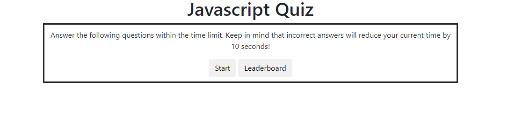
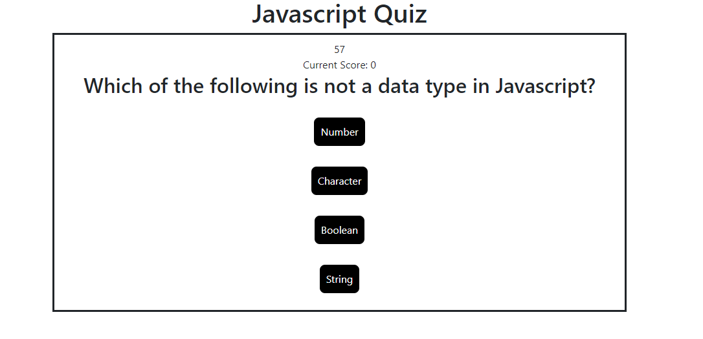

# CodingQuiz
Coding Quiz

## Description and Requirements

Coding assessments are an important part of the interview process for developers. In fact, employers often use them to filter out job candidates with a cut-off score. To help prepare and become familiar with these tests, this module’s Challenge built a timed coding quiz with multiple-choice questions. This app will run in the browser, and will feature dynamically updated HTML and CSS powered by JavaScript. 

```
AS A coding boot camp student
I WANT to take a timed quiz on JavaScript fundamentals that stores high scores
SO THAT I can gauge my progress compared to my peers

GIVEN I am taking a code quiz

WHEN I click the start button
THEN a timer starts and I am presented with a question
<!-- Done -->

WHEN I answer a question
THEN I am presented with another question
<!-- Done -->

WHEN I answer a question incorrectly
THEN time is subtracted from the clock
<!-- Done -->

WHEN all questions are answered or the timer reaches 0
THEN the game is over
<!-- Done -->

WHEN the game is over
THEN I can save my initials and score
<!-- Done -->

```

### Mock-Up

The following image shows the web application's appearance and functionality:




#### Live Link

https://halliemestas.github.io/CodingQuiz/